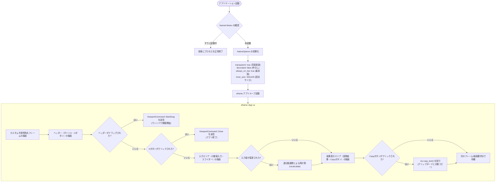

# システム構成図 (DIAGRAM.md)

このドキュメントでは、CLI版の処理フローおよび予定しているGUI版のアーキテクチャ構成図をダイアグラムを用いて視覚的に説明します。

---

## 1. CLI 実行処理フロー

CLI版は、入力値を順次処理する手続き的なフローになっています。

```mermaid
graph TD
    Start([プログラム開始]) --> CheckArgs{引数は2個以上?}
    
    CheckArgs -- いいえ --> PrintHelp[stderr に使用方法を出力]
    PrintHelp --> ExitFail([終了コード 1 で終了])
    
    CheckArgs -- はい --> CheckHelp{第1引数が --help, -h?}
    CheckHelp -- はい --> PrintDetailHelp[stdout に詳細ヘルプを出力]
    PrintDetailHelp --> ExitSuccess([終了コード 0 で終了])
    
    CheckHelp -- いいえ --> CheckVersion{第1引数が --version, -v, -V?}
    CheckVersion -- はい --> PrintVersion[stdout に 'bunka バージョン' を出力]
    PrintVersion --> ExitSuccess
    
    CheckVersion -- いいえ --> ParseVal{第1引数を f64 に変換}
    
    ParseVal -- 失敗 --> PrintParseError[stderr に '無効な浮動小数点' エラーを出力]
    PrintParseError --> ExitFail
    
    ParseVal -- 成功 val --> InitParams["デフォルト値設定:<br>max_den = 100,000<br>tolerance = 1e-6"]
    
    InitParams --> LoopArgs{残りの引数ループ<br>i = 2 .. args.len()}
    
    LoopArgs -- ループ中 --> CheckOpt{引数 args[i] の判定}
    
    CheckOpt -- -d / --max-den --> ParseMaxDen{次の引数値を正の整数としてパース}
    ParseMaxDen -- 成功 --> UpdateMaxDen[max_den を更新, i += 2]
    UpdateMaxDen --> LoopArgs
    ParseMaxDen -- 失敗 --> OptError[stderr にオプションエラー出力]
    OptError --> ExitFail
    
    CheckOpt -- -t / --tolerance --> ParseTol{次の引数値を正の数としてパース}
    ParseTol -- 成功 --> UpdateTol[tolerance を更新, i += 2]
    UpdateTol --> LoopArgs
    ParseTol -- 失敗 --> OptError
    
    CheckOpt -- その他 --> OptError
    
    LoopArgs -- ループ完了 --> InitAlgo[初期化: h1, h2, k1, k2, r, a, step = 0]
    
    InitAlgo --> LoopCF{ステップ数 <= 50?}
    
    LoopCF -- はい --> CalcConvergent["現在の近似分数 h_n, k_n を計算"]
    CalcConvergent --> CheckDen{分母 k_n > max_den?}
    
    CheckDen -- はい --> BreakLoop[ループ中断: 1つ手前の結果を採用]
    CheckDen -- いいえ --> UpdateError[近似値および絶対誤差の計算]
    
    UpdateError --> ErrorCriteria{誤差 <= tolerance または 残差小数部 ~ 0?}
    ErrorCriteria -- はい --> BreakLoop
    ErrorCriteria -- いいえ --> PrepNext["残差 r = 1 / (r - a)<br>整数部 a = floor(r)"]
    PrepNext --> LoopCF
    
    LoopCF -- いいえ --> OutputResult[最終結果分子/分母の整形]
    BreakLoop --> OutputResult
    
    OutputResult --> PrintResult[stdout に '分子/分母' 形式で出力]
    PrintResult --> ExitSuccess
```

---

## 2. GUI 実行処理フロー（アーキテクチャ構成）

GUI版は、`egui`/`eframe` が制御するインタラクティブな状態更新ループで動作します。



